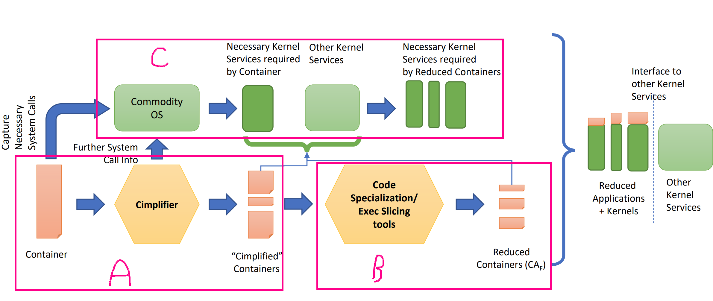

This week works were aroung these 2 question:
> Do you have any novel ideas about this topic, based on your readings?

> What do you think is interesting to do (from a research point of view)?

### Done

- Read papers:
  - [Gang of Eight: A Defect Taxonomy for Infrastructure as Code](https://ieeexplore.ieee.org/document/9284113)
  - [New Directions for Container Debloating](https://dl.acm.org/doi/abs/10.1145/3141235.3141241)
  - [Techniques and Tools for De-bloating Containers](https://security.csl.toronto.edu/wp-content/uploads/2018/06/ONR_Debloating.pdf)
  - [Cimplifier: automatically debloating containers](https://dl.acm.org/doi/10.1145/3106237.3106271)
  - [GLITCH: an Intermediate-Representation-Based Security Analysis for Infrastructure as Code Scripts](https://arxiv.org/abs/2205.14371)
  - [Different Kind of Smells: Security Smells in Infrastructure as Code Scripts](https://ieeexplore.ieee.org/abstract/document/9388795)
- Got [`Cimplifier` source code](/related-works/cimplifier)

### Discussion

As I discussed in the previous report, there are 2 levels of infrastructure components:
1. High level infrastructure components (VMs, K8s components, network configurations, system configurations, etc.): Much of the work in this area consists of analysing security issues and smels (as in the works of GLITCH or Rahman et al.). Debloating at this level can be interpreted as minimizing attack surface and removing not dependent components or applying intuitive best practices. Further reading on this topic won't help.
2. Containers: here are 3 sub levels to discuss more:

  **A.** In the figure, the first level is to partition processes into containers. Here debloating doesnt mean anything special but it can be a prerequisite for further steps. Compiler focused on this step and detected separate processes through system call logging (to find a dependency graph) and some simple developer constraints. *I got some ideas to move this approach one step further:*
  - Partition an executable based upon the partitioning found by dynamic analysis of an application.
  - Working on removing user-input constraints from the application.
  - Cimplifier (and other debloating tools like docker-slim) needs test suites or some automation checking of application functionality to find process dependency. We can use fuzzing tools and techniques to drive the program to execute all possible functionalities and make an execution to traverse all possible paths in the program.
  - Integrating symbolic execution can also increase code coverage. There are some language specific tools like Angr, Klee, driller.

  **B.** Debloating the program/process itself is another aspect of debloating containers. Some tools like DepClean or other language specific tools can help us here. We can benefit from partial evaluation codes techniques such as compiler level common optimization (like determining candidate certifications), removing unneeded dependencies or features. It is more general than the container debloating category we are focusing at.

  **C.** The kernel processes in containers can be debloated in a few ways. (which are mentioned in [Techniques and Tools for De-bloating Containers](https://security.csl.toronto.edu/wp-content/uploads/2018/06/ONR_Debloating.pdf) but there isnt enough detail about techniques):
  - [Proxos-based kernel debloating](https://www.usenix.org/legacy/event/osdi06/tech/full_papers/ta-min/ta-min_html/index.html).
  - [Unikernels](http://unikernel.org/)
  - Compiling minimal kernel, which is complicated and needs domain knowledge about kernel
  - file reduction: there is syscall-based discovery (like Cimplified) and sensor-based discovery like docker-slim.

### TODO
- To review Cimplified source code (unfortunately it isn't clean code). I also want to investigate whether it is possible to integrate symbolic execution tools with that or not.
- To review the docker-slim source code and understand the approach.
- To read:
  - Proxos
  - Unikernels
  - Tinyconfig