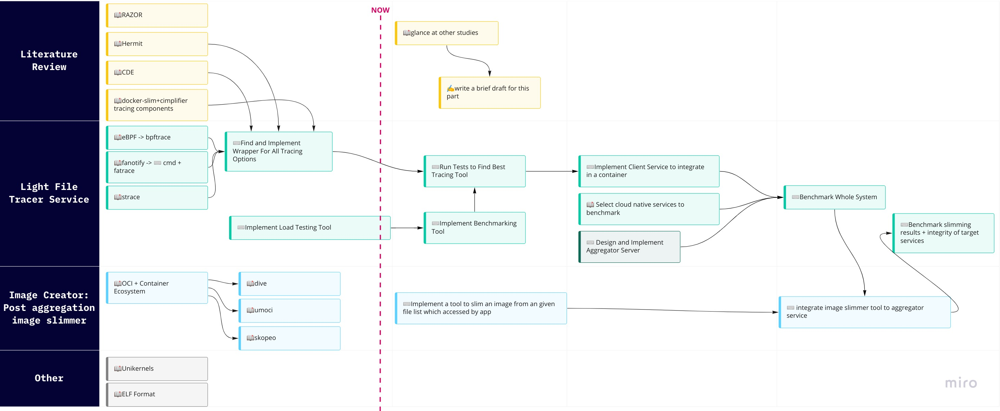
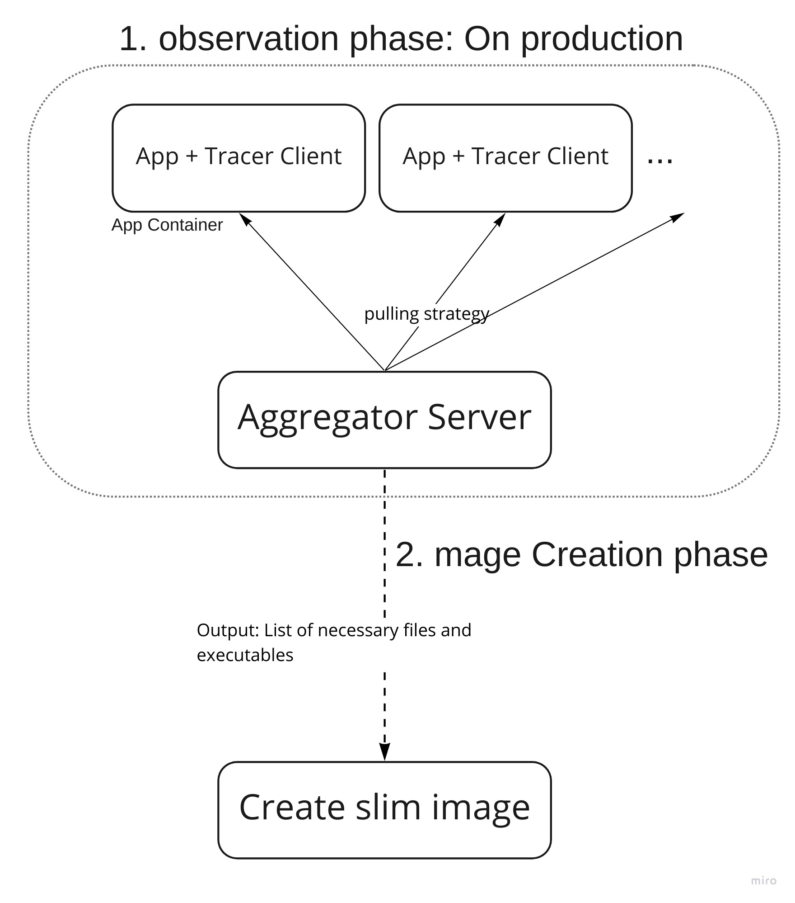

I am currently following 3 paths simultaneously, which I describe in detail in the following sections:

## Literature Review
In this direction, I am finding novel methods for debloating containers. As far as I know, I have read almost all notable research in this area. In the next step I will attempt to write a draft description of past studies.

Done (read):
- [A sense of self for unix processes](https://www.ieee-security.org/TC/SP2020/tot-papers/forrest-1996.pdf)
- [Hermit paper](https://repositorio-aberto.up.pt/bitstream/10216/135486/2/487218.pdf),[+](https://www.youtube.com/watch?v=f-oTe-dmfyI)
- [CDE paper](https://www.usenix.org/conference/usenixatc11/cde-using-system-call-interposition-automatically-create-portable-software),[+](https://www.youtube.com/watch?v=6XdwHo1BWwY)
- [RAZOR paper](https://www.usenix.org/conference/usenixsecurity19/presentation/qian) lead me to read more about dyanmic linking and ELF format analysis.

Todo (to read):
- [A Novel Approach to Containerize Existing Applications](https://repository.lib.fit.edu/handle/11141/2518)
- [FogDocker](https://hal.archives-ouvertes.fr/hal-02332679)
- [Optimizing Service Delivery with Minimal Runtimes](https://link.springer.com/chapter/10.1007/978-3-319-91764-1_35)
- [An Empirical Analysis of the Docker Container Ecosystem on GitHub](https://ieeexplore.ieee.org/document/7962382)
- [Confine: Automated System Call Policy Generation for Container Attack Surface Reduction](https://www.usenix.org/conference/raid2020/presentation/ghavanmnia)
- [Automatic container definition](https://patents.google.com/patent/US20160350081)

## File Tracer Service

Our previous email agreed that we should develop a tool (that consists of a client and server component) for monitoring on-production dependencies. On the client side, which will deploy within an application container, a tool is required to trace the binary and file dependencies of the application. Meanwhile, a server will be required to gather and aggregate stats from all containers. Due to the transient nature of containers in cloud technologies like Kubernetes, and the scalability concerns in this ecosystem, I chose to use the [Prometheus pulling strategy](https://prometheus.io/blog/2016/07/23/pull-does-not-scale-or-does-it/). This is to have a server pull data from clients and a client which serves that data on a http server.

To implement a file access tracker client, I looked for already developed tools to trace processes. All of them were using a method to monitor syscalls or communicate with kernel to follow files opened by process. I have read about them and tried some of them to compare them with each other. Ultimately, I decided to write some tool to benchmark them in order to determine which one performed the most efficiently in terms of speed and resource overhead. Detailed information about each of the methods can be found in the [tracer directory](../benchmarks/tracer/).

Done:
- Implemented [`Loder`](../benchmarks/tracer/loder/): a benchmarking tool that uses multiple file dependencies in order of configuration.
- Read more about the [eBPF](https://ebpf.io/what-is-ebpf)([+](https://www.youtube.com/watch?v=uBqRv8bDroc),[+](https://www.youtube.com/watch?v=bj3qdEDbCD4),[+](https://www.youtube.com/watch?v=0p987hCplbk),[+](https://www.youtube.com/watch?v=lrSExTfS-iQ)) that the professor offered.
- Implemented simple [eBPF script](../benchmarks/tracer/bpftrace/opensnoop.bt) to trace file access. (***NOTE*: None of the previous studies used this technology to trace a process. Duo to its performance and flexibility, it may be an interesting option to continue.**)
- Read more about fanotify and related tools
- Implemented [a fanotify API cmd line wrapper in go](../benchmarks/tracer/fanotify-cmd/).
- Read more about `strace` and related syscalls to process dependecy: `open, openat, close, read, getdents,write, connect, accept`

Todo:
- Add features to Loder tasks to create files, execute binary, delete some files, run multiple threads and subprocesses. The goal is to make an extensive tool to benchmark every tracing method.
- Implement a benchmarking tool for each tracing option.

## Container Image Creation

Considering we have a list of files and binaries that are required for an application to run in a container from the previous section tool, now we need a way to create a slimmer image in the post-observation phase. I delved into the specification of standard container images, and I will continue to search for a tool to recreate those images. If I didnt find anything, I would need to implement a tool on my own to do this favor.

Done:
- Explored the OCI and container ecosystem in greater detail. I summarized what I learned in a [presentation file](./containers-presentation.pdf).
- Reviewed container image related tools: [dive](https://github.com/wagoodman/dive), [umoci](https://umo.ci/), [skopeo](https://github.com/containers/skopeo)

Todo:
- Find a existing way to recreate a slimmer image with a list of necessary files to run an application.

## Misc

Done:
- Read about [Unikernels](http://unikernel.org/files/2013-asplos-mirage.pdf)
