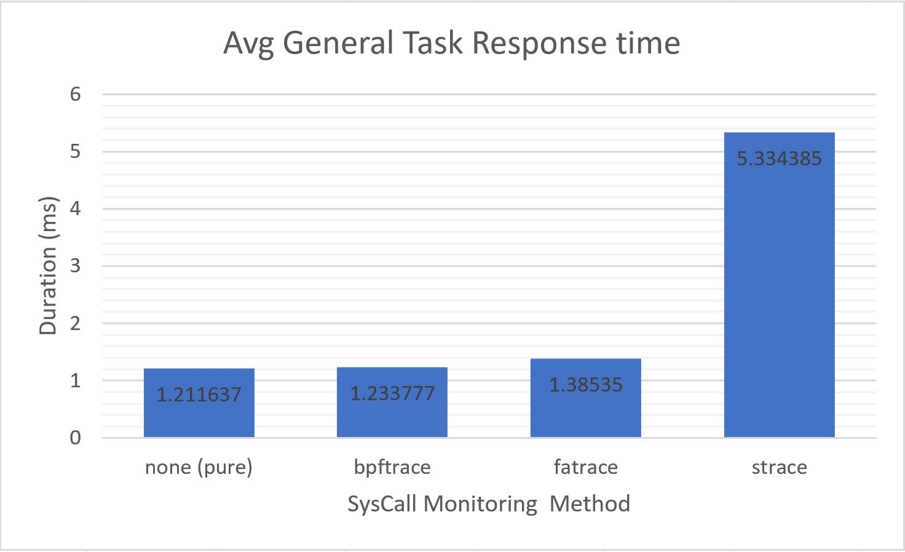

Let me give some updates on my 3 paths (as I said in the [previous report](https://github.com/erfan-mehraban/debloating-software-infrastructure/blob/main/reports/2022-07-22.md)):

## Litrature Review
My research in this direction is focused on finding new methods to debloat containers. Unfortunately, I couldn't write a brief draft of the literature review as I said I would. In the subsequent sections, I will discuss the details of other directions I attempted to focus on.

Done (read):
- [A Novel Approach to Containerize Existing Applications](https://repository.lib.fit.edu/handle/11141/2518)
- [FogDocker](https://hal.archives-ouvertes.fr/hal-02332679)
- [Optimizing Service Delivery with Minimal Runtimes](https://link.springer.com/chapter/10.1007/978-3-319-91764-1_35)
- [An Empirical Analysis of the Docker Container Ecosystem on GitHub](https://ieeexplore.ieee.org/document/7962382)

Todo (to read):
- [Confine: Automated System Call Policy Generation for Container Attack Surface Reduction](https://www.usenix.org/conference/raid2020/presentation/ghavanmnia)
- [Automatic container definition](https://patents.google.com/patent/US20160350081)

## File Tracer Service

As I wrote, I tried to focus on finding the most appropriate monitoring tool to observe and record file access syscalls. To compare them in an evidential manner, I created [a benchmarking script and a load test tool](https://github.com/erfan-mehraban/debloating-software-infrastructure/tree/main/benchmarks/tracer/). [The `loder` tool, a file access demand generator tool which I developed](https://github.com/erfan-mehraban/debloating-software-infrastructure/tree/main/benchmarks/tracer/loder), now can run [configurable tasks which are described in YAML format](https://github.com/erfan-mehraban/debloating-software-infrastructure/blob/main/benchmarks/tracer/loder/tasks.yml). This allows it to run multiple workers simultaneously for a specific duration. In addition, I recorded a brief and general benchmark on monitoring tools candidates and it appears that [`bpftrace`](https://github.com/erfan-mehraban/debloating-software-infrastructure/tree/main/benchmarks/tracer/bpftrace) (which uses ebfp in the backend) has a comparatively low overhead when compared to other tools. `strace` which [Cimplifier code uses it](https://github.com/erfan-mehraban/debloating-software-infrastructure/blob/main/related-works/cimplifier/code/straceparser.py) is about 5x slower than other methods and this makes it a very inefficient choice to use in the production environment. `fatrace` with 14% CPU overhead uses `fanotify` as a backend, [which is used by `docker-slim`](https://github.com/docker-slim/docker-slim/blob/master/pkg/third_party/madmo/fanotify/) and it is a worse alternative than bpftrace. The main point of bpftrace is to run hidden from the main process and to handle [syscalls asynchronously](https://manpages.ubuntu.com/manpages/kinetic/man8/bpftrace.8.html#sync%20and%20async).

Done:
- Completed `loder` (Details can be found in [the repository commit list](https://github.com/erfan-mehraban/debloating-software-infrastructure/search?q=loder&type=commits)):
  - Add runtime duration
  - Add concurrent worker processes to do task
  - Add task types:
    - execute binary by forking process and forking thread
    - link
    - rename
    - mkdir + rmdir
    - chown + chmod
    - soft and hard link
    - direct write and read from disk to bypass kernel cache
  - Add benchmarking stat (throuput and latency)
- Ran and analysed brief general test which runs all task types once
- Implemented [a benchmarking scripts to run each tool and save results and system resource statistics](https://github.com/erfan-mehraban/debloating-software-infrastructure/tree/main/benchmarks/tracer).

Todo:
- Create a particular task configuration to find weak point of each tracing tool especialy bpftrace
- Run more comprehensive benchmark and summarise results to mention in the final paper
- Complete bpftrace script to track all desired syscalls.
- Filtering and correcting file access result list from bpftrace (Like detecting symlinks or deleted files).

## Container Image Creation

This approach results in a tool that can create a slim image based on accessed files. [**This part is almost done.**](https://github.com/erfan-mehraban/debloating-software-infrastructure/tree/main/tools/slimmer) I tried to write a program to generate an image from scratch but I found there was a lot of detail in that. I searched for a standard and existing tool to create an image, and found [umoci](https://umo.ci/), which was developed [under the OCI standard repository](https://github.com/opencontainers/umoci/releases). Thus, I wrote a script that uses the internal commands of this tool to create a one layer slim image with just that file list as input. I tested it on simple images and it works fine. By doing this it reduces all the layers to just one (to remove unnecessary history) and copies only whitelisted files, as well as setting up a container configuration file to act as before. The next step is to integrate it with bpftrace results.

Done:
- Wrote [a script](https://github.com/erfan-mehraban/debloating-software-infrastructure/tree/main/tools/slimmer) to recreate a slimmer image with a list of necessary files to run an application

## Client and Server tool to monitor syscalls

In this newly developed direction, I am planning to integrate bftrace in some containers and configure them to expose this list to an aggregate server in a production environment. The server should gather and summarize this list as a final result of every accessed file of any application in production.

Todo:
- Implement client service to monitor syscalls with bpftrace
- Implement aggregator service
